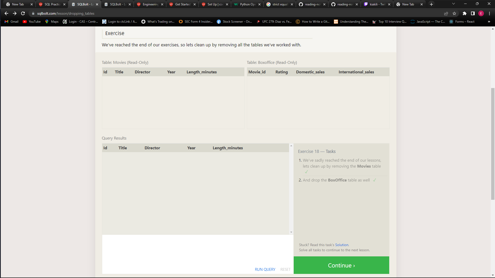

# Introduction to SQL

SQL stands for Structured Query Language. It is a search language we use to instructa a database about what information we would like to retrieve from it.

Relational databases represent a collection of related two-dimensional tables.

Select query for a specific column 
```
SELECT column, another column, ..
FROM mytable
```

select query for all columns
```
SELECT * FROM mytable:
```

select query with constraints

```
SELECT column, another_column, …
FROM mytable
WHERE condition
    AND/OR another_condition
    AND/OR …;
```

Select query with ordered results
```
SELECT column, another_column, …
FROM mytable
WHERE condition(s)
ORDER BY column ASC/DESC;
```

Select query with limited rows
```
SELECT column, another_column, …
FROM mytable
WHERE condition(s)
ORDER BY column ASC/DESC
LIMIT num_limit OFFSET num_offset;


```

Select query with INNER JOIN on multiple tables
```
SELECT column, another_table_column, …
FROM mytable
INNER JOIN another_table 
    ON mytable.id = another_table.id
WHERE condition(s)
ORDER BY column, … ASC/DESC
LIMIT num_limit OFFSET num_offset;
```

Select query with LEFT/RIGHT/FULL JOINs on multiple tables
```
SELECT column, another_column, …
FROM mytable
INNER/LEFT/RIGHT/FULL JOIN another_table 
    ON mytable.id = another_table.matching_id
WHERE condition(s)
ORDER BY column, … ASC/DESC
LIMIT num_limit OFFSET num_offset;
```

Select query with constraints on NULL values
```
SELECT column, another_column, …
FROM mytable
WHERE column IS/IS NOT NULL
AND/OR another_condition
AND/OR …;
```

Example query with expressions
```
SELECT particle_speed / 2.0 AS half_particle_speed
FROM physics_data
WHERE ABS(particle_position) * 10.0 > 500;
```

Select query with aggregate functions over all rows
```
SELECT AGG_FUNC(column_or_expression) AS aggregate_description, …
FROM mytable
WHERE constraint_expression;
```

Some common aggregate functions that we use include

```
COUNT(*)
COUNT(column)- counts the no of rows in the group 
MIN(column) - finds smallest numerical value in specified column
MAX(column) - finds largets numerical value in specified colum
AVG(column) - finds the average numerical value in specified column
SUM(column) - finds sum of all numerical value in specified column
```

Select query with HAVING constraint
```
SELECT group_by_column, AGG_FUNC(column_expression) AS aggregate_result_alias, …
FROM mytable
WHERE condition
GROUP BY column
HAVING group_condition;
```

## Complete SQL QUERY

```
SELECT DISTINCT column, AGG_FUNC(column_or_expression), …
FROM mytable
    JOIN another_table
      ON mytable.column = another_table.column
    WHERE constraint_expression
    GROUP BY column
    HAVING constraint_expression
    ORDER BY column ASC/DESC
    LIMIT count OFFSET COUNT;
```

Updating Rows
```
UPDATE mytable
SET column = value_or_expr, 
    other_column = another_value_or_expr, 
    …
WHERE condition;
```

Deleting Rows
```
DELETE FROM mytable
WHERE condition;
```

Creating Tables
```
CREATE TABLE IF NOT EXISTS mytable (
    column DataType TableConstraint DEFAULT default_value,
    another_column DataType TableConstraint DEFAULT default_value,
    …
);
```

Altering a table to add new columns
```
ALTER TABLE mytable
ADD column DataType OptionalTableConstraint 
    DEFAULT default_value;
```

Altering table name
```
ALTER TABLE mytable
RENAME TO new_table_name;
```

Dropping Tables
```
DROP TABLE IF EXISTS mytable;
```

Schema is used to describe a collection of tables and their relationships.

## Screenshots



