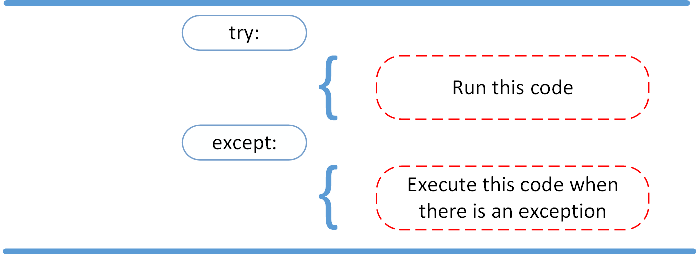
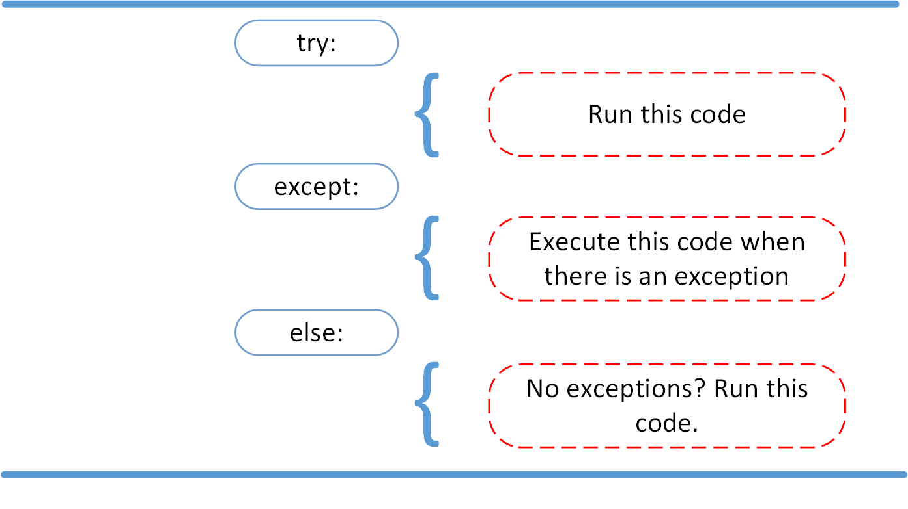
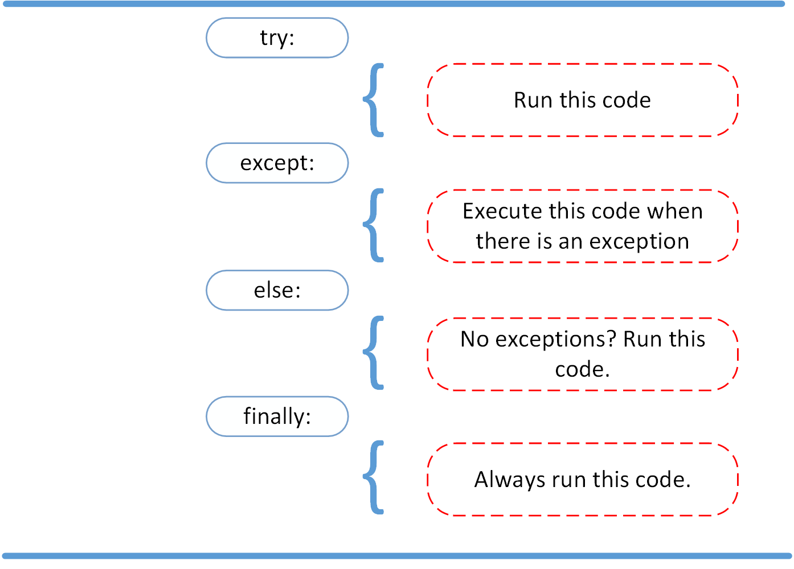

# FileIO and Exceptions

## Read and Write Files in Python

[source](https://realpython.com/read-write-files-python/)

A `file` is a contiguous set of bytes used to store data.

Files composed of three main parts

1. Header - metadata about the contents of the file

2. Data - contents of the file

3.End of file - special character that indicates the end of the file. 

`File paths` are required to access a file on an operating system.

Example 
```
path/to/cats.gif
```
folder path/file name/extension

```(..)``` is used to move up one directory

To open a file in python we use the ```open() built-in function```

```

file = open('cats_breeds.txt')

You can employ two ways to close a file

With a `try-finally` block.

```
```
reader = open('dog_breeds.txt')
try:
    # Further file processing goes here
finally:
    reader.close()
```

and using a `with` statement which is better as it is more cleaner code and makes handling any unexpected errors easier.

Multiple characters to represent how you want to oepn a file include:

`r` - open for reading

`w` - open for writing

`rb` or `wb` open in binary mode

There are three different categories of file objects:

1. Text files

2. Buffered binary files

3. Raw binary files

**Reading and writing opened Files** 

`.read()` reads from the files based on the number of size bytes.

`readline()` reads at most size number of characters from the line.

`readlines()` reads remaining lines from the file object and returns them as a list.

`.write(string)` 	This writes the string to the file.

`.writelines(seq)` 	This writes the sequence to the file..

## Exceptions in Python

[source](https://realpython.com/python-exceptions/)

**Exceptions error** occurs whenever syntatically correct Python code results in an error.

We can use `raise` to throw an exception error if a condition occurs.

```
y = 9
if y > 5:
      raise Exception('y should not exceed 5. The value of y was: {}'.format(y))
```

The `try` and `except` block in python is used to catch and handle exceptions.

In the try clause, all statements are executed until an exception is encountered.

except is used to catch and handle the exception(s) that are encountered in the try clause.



**Note Better**

1. A try clause is executed up until the point where the first exception is encountered.

2. Inside the except clause, or the exception handler, you determine how the program responds to the exception.

3. You can anticipate multiple exceptions and differentiate how the program should respond to them.

**Else Clause**

We use it to instruct a program to execute a certain block of code only in the absence of exceptions.






`finally` enables you to execute sections of code that should always run, with or without any previously encountered exceptions.